# Jarkom-Modul-3-A11-2023

**Praktikum Jaringan Komputer Modul 3 Tahun 2023**

## Penulis

| Nama                | NRP        | Github                         |
| ------------------- | ---------- | ------------------------------ |
| Muhammad Zien Zidan | 5025211122 | https://github.com/zienzidan   |
| Glenaya             | 5025211202 | https://github.com/nyawnayaw05 |

## Topologi

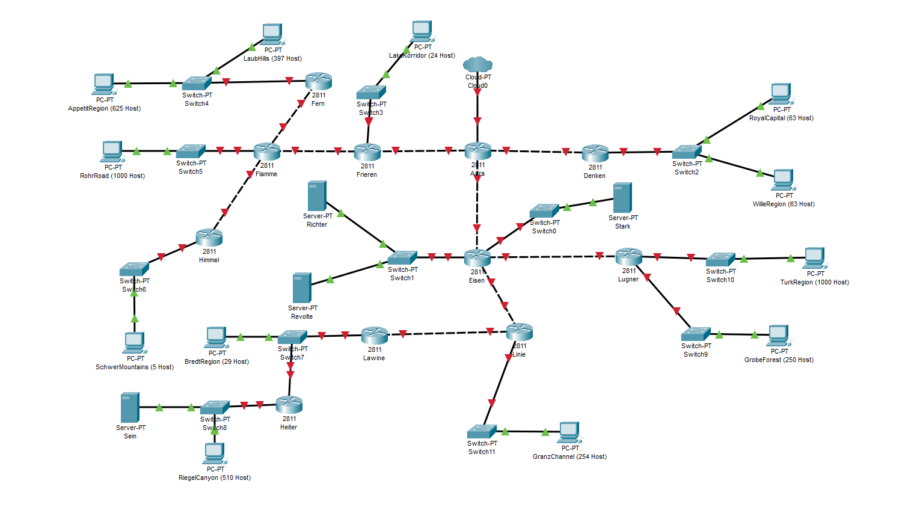

## Soal

Dalam soal praktikum kali ini, kita disajikan dengan sebuah topologi yang memerlukan penyelesaian melalui Cisco Packet Tracer dan GNS3. Tugas yang diberikan menuntut penerapan metode perhitungan CLASSLESS yang berbeda satu sama lain.
Selain itu, kita juga harus membagi IP dan routing se-efisien mungkin.

## Jawaban

Disini kita sepakat untuk menggunakan metode VLSM pada GNS3 dan metode CIDR pada Cisco Packet Tracer.

### Langkah Ke 1

> Kita harus menentukan rute dari topologi yang sudah diberikan

Berikut rute yang kami temukan
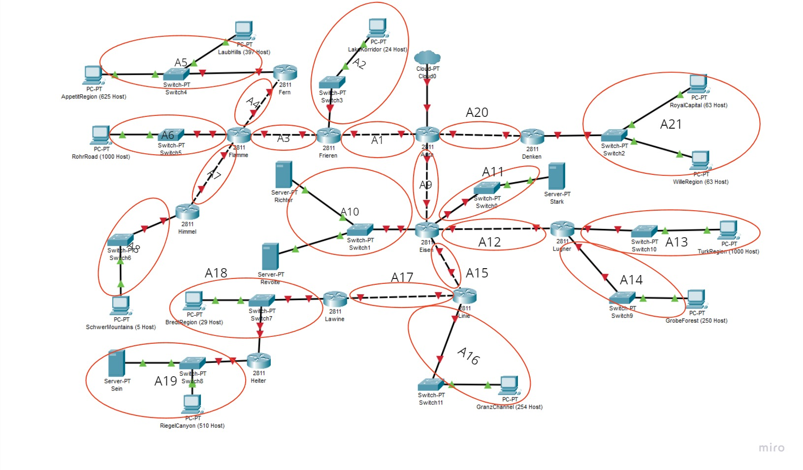

agar lebih jelas, kami juga mengisi sheet yang telah ditentukan.
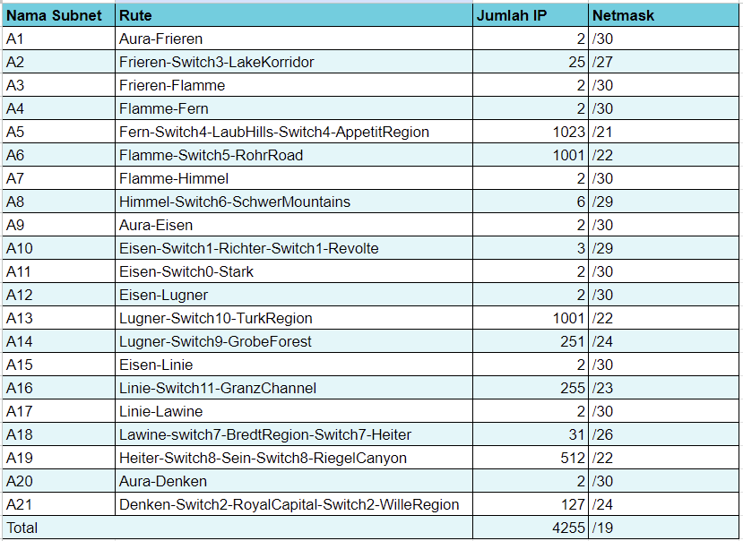

### Langkah Ke 2

> Tentukan Pembagian IP pada VLSM

### Langkah Ke 3

> Lakukan Penggabungan rute hingga menjadi satu kesatuan agar dapat dibuat pembagian IP CIDR

Lakukan penggabungan Subnet B

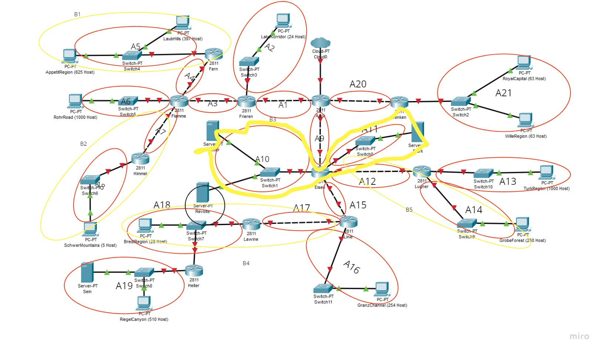

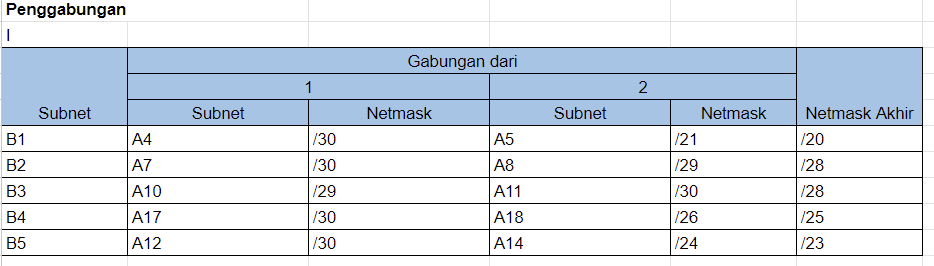

Lakukan penggabungan Subnet c

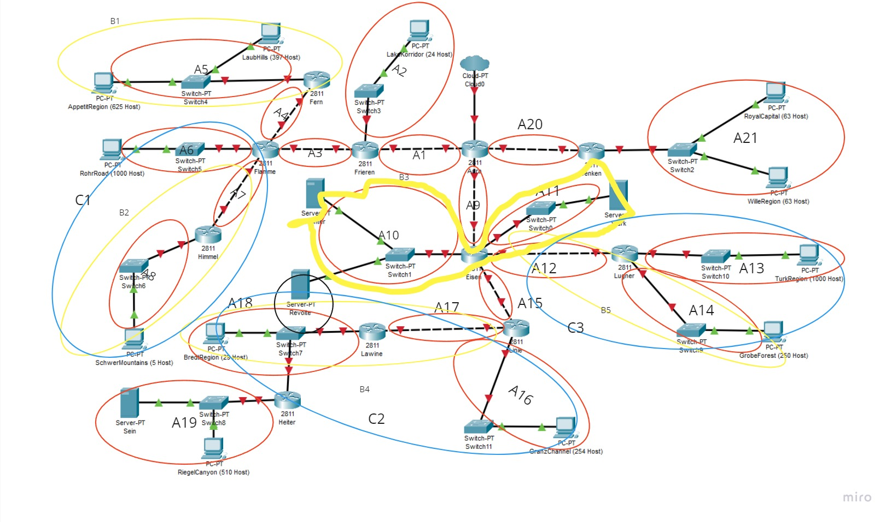

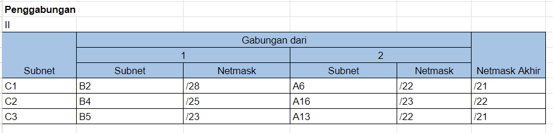

Lakukan penggabungan Subnet D

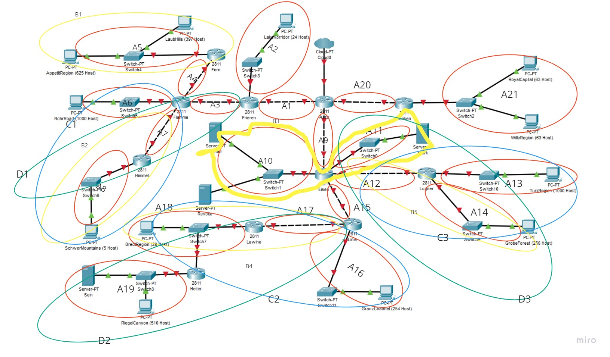

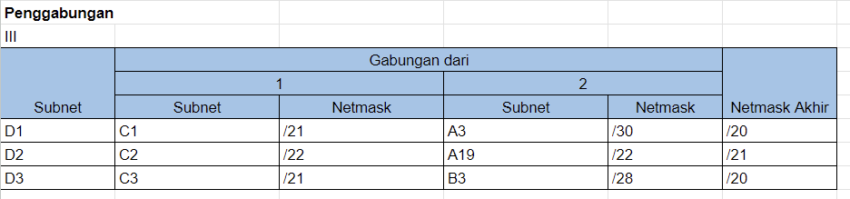

Lakukan penggabungan Subnet E

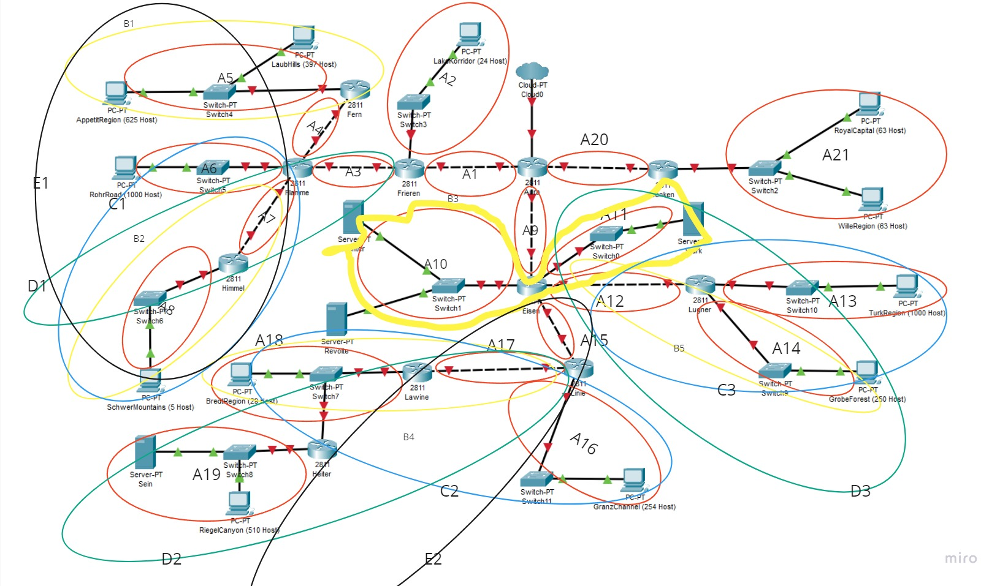

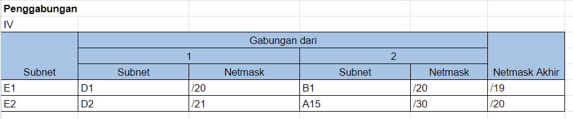

Lakukan penggabungan Subnet F

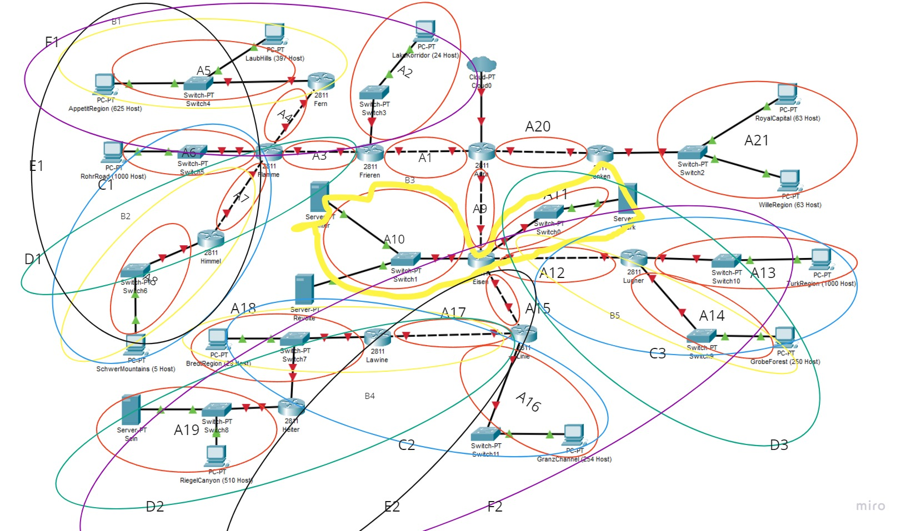

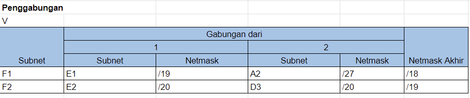

Lakukan penggabungan Subnet G

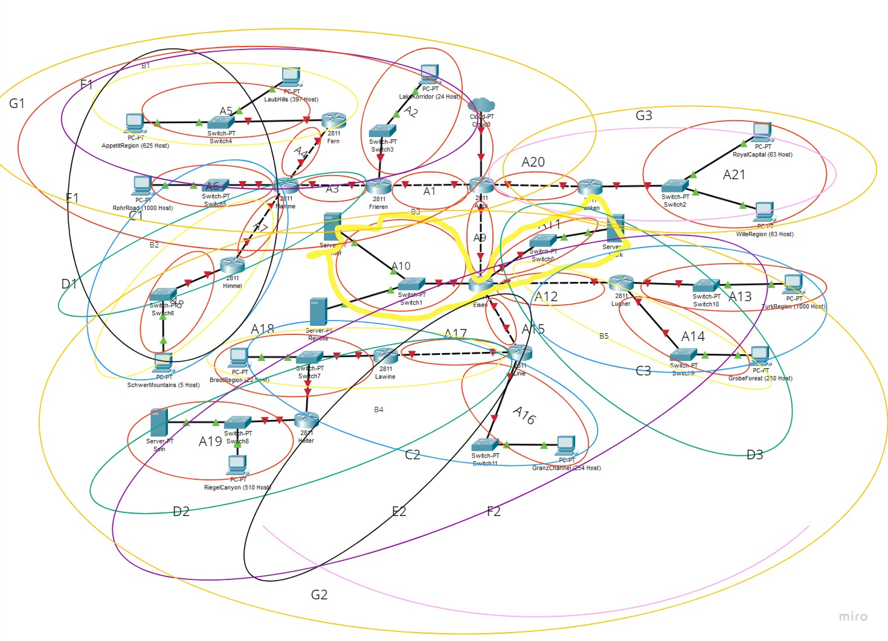

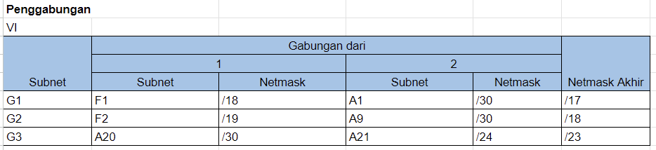

Lakukan penggabungan Subnet H

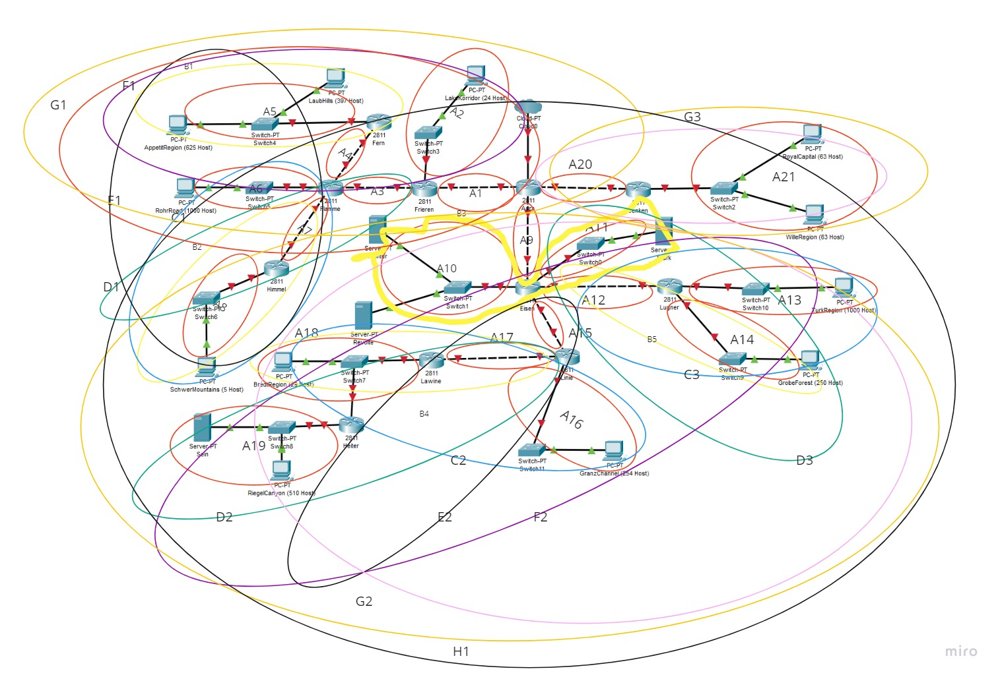

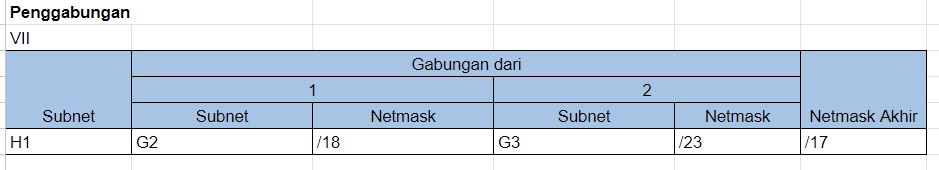

Lakukan penggabungan Subnet I

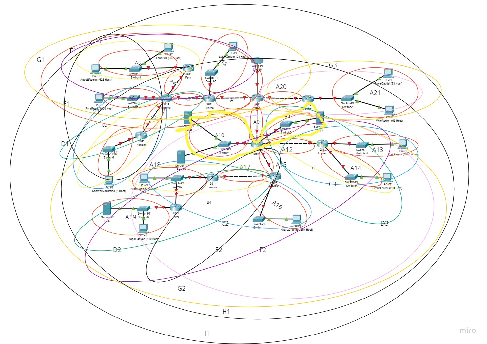

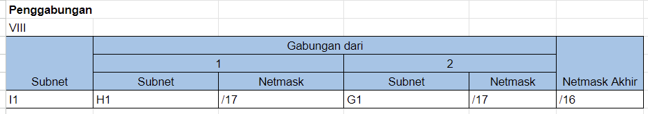

### Langkah Ke 4

> Setelah mendapatkan penggabungan CIDR lakukan pembagian IP untuk CIDR

Lakukan pembuatan tree untuk pembagian CIDR


Lalu tentukan Network ID dan Broadcast untuk CIDR

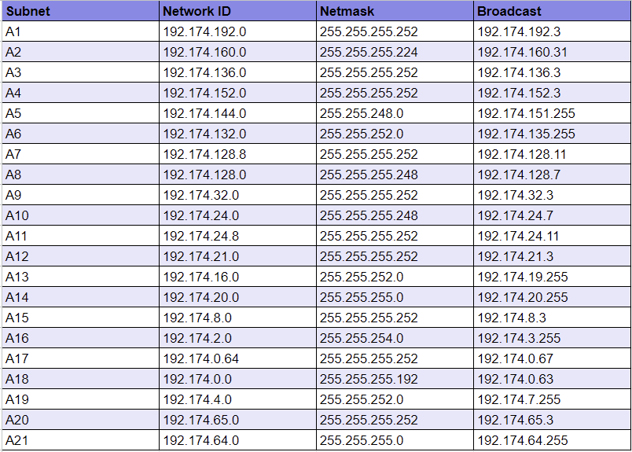

Selanjutnya tentukan alamat IP dengan cara diantara NetworkID hingga Brodcast disetiap subnet, sehingga nantinya akan digunakan untuk subnetting pada setiap node nya (router, client,server dan lain lain).

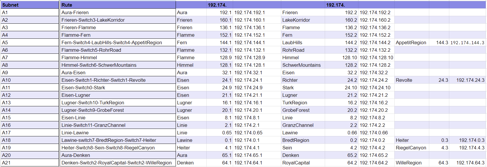

dan lakukan testing dengan cara mengirim pesan pada node yang sejalan
seperti contoh ApppetitRegion dan LaubHills mengirim pesan kepada router fern

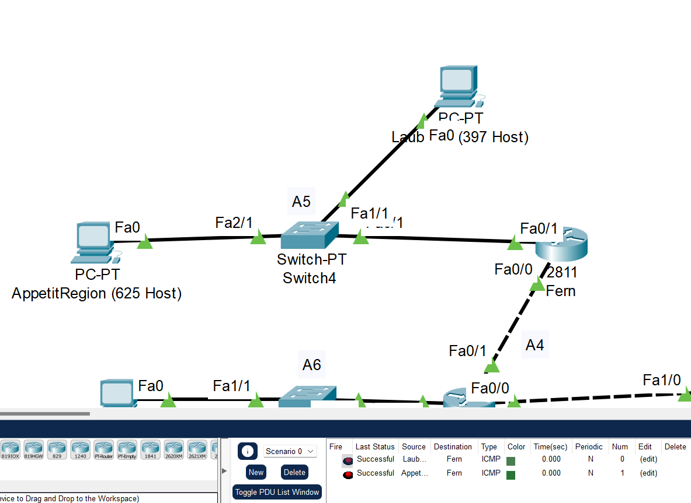

Terakhir, lakukan routing di setiap node nya agar saling terhubung dan menjadikan Aura sebagai router tertinggi.

Seperti yang akan saya contohkan ialah melakukan routing dari Fern dan himmel ke Flamme

.png>)

Lakukan config static didalam setiap node router

> Fern

isi config static seperti dibawah ini (agar memberikan permission ke router yang dituju)

```
Network     : 0.0.0.0
Mask        : 0.0.0.0
Next Hop    : 192.174.152.1 (Isi sesuai IP FastEthernet yang mengakses ke Flamme)
```

.png>)

> Himmel

isi config static seperti dibawah ini (agar memberikan permission ke router yang dituju)

```
Network     : 0.0.0.0
Mask        : 0.0.0.0
Next Hop    : 192.174.128.9 (Isi sesuai IP FastEthernet yang mengakses ke Flamme)
```

.png>)

> Flamme

isi config static router yang mengakses router lain
seperti contoh dibawah ini flamme mengakses subnet A5 milik Fern

```
Network     : 192.174.144.0 (Isi sesuai subnet yang ingin diakses)
Mask        : 255.255.248.0 (isi sesuai netmask dari subnet tersebut)
Next Hop    : 192.174.152.2 (Isi sesuai IP FastEthernet yang mengakses ke Fern)
```

Lakukan hal sebaliknya mengakses Subnet A8 milik Himmel

```
Network     : 192.174.128.0 (Isi sesuai subnet yang ingin diakses)
Mask        : 255.255.255.248 (isi sesuai netmask dari subnet tersebut)
Next Hop    : 192.174.128.10 (Isi sesuai IP FastEthernet yang mengakses ke Fern)
```

Lakukan juga permission ke dalam router Frieren

```
Network     : 0.0.0.0
Mask        : 0.0.0.0
Next Hop    : 192.174.136.1 (Isi sesuai IP FastEthernet yang mengakses ke Frieren)
```

.png>)

Lakukan hal yang sama di dalam router Frieren yaitu dengan mengakses subnet yang dibutuhkan dan memberikan permission ke router utama yaitu Aura agar bisa saling terhubung

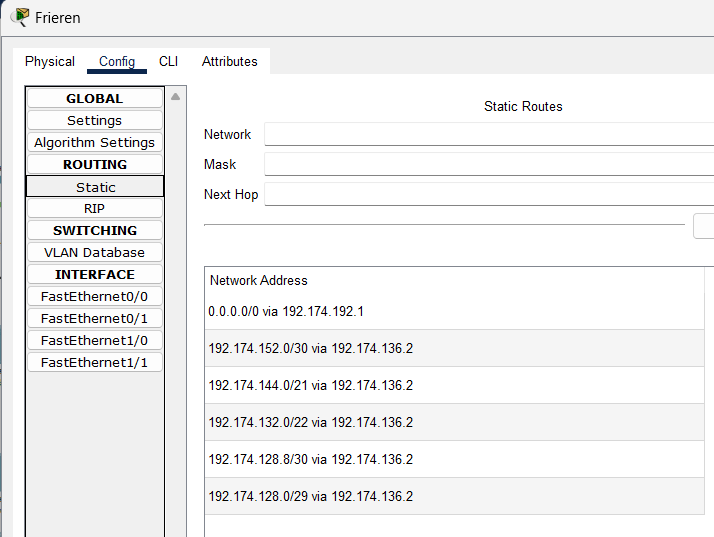

Lakukan hal yang sama ke dalam router Eisen dan Denken bilamana ada sub router atau router yang lebih kecil lakukan pengaksesan dan permission kepada router yang lebih besar.

Didalam router Aura lakukan pengaksesan kepada seluruh subnet kecuali subnet yang sudah terhubung seperti A3, A9, A20

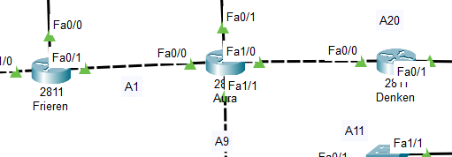

Aura hanya boleh mengakses subnet dan tidak memberikan permission karena aura disini bertindak sebagai router utama yang harus bertindak secara adil.

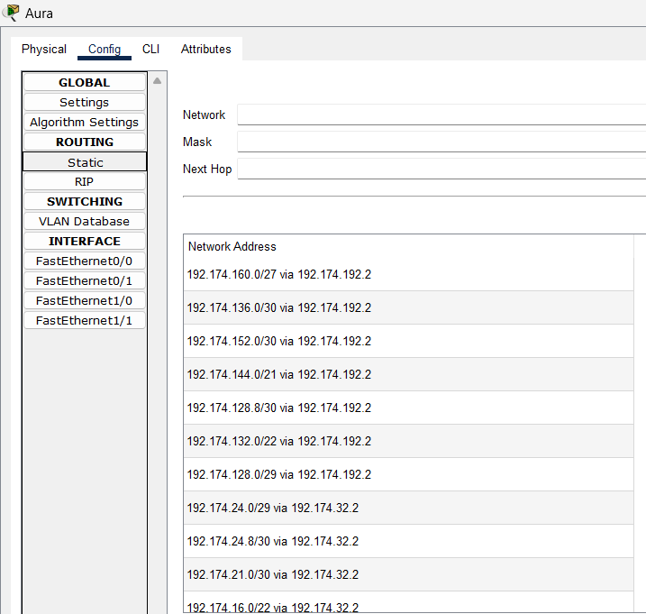

> Testing

Lakukan pengiriman pesan atau ping ke alamat IP yang dituju

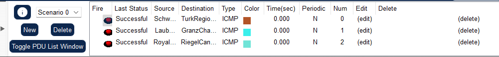
